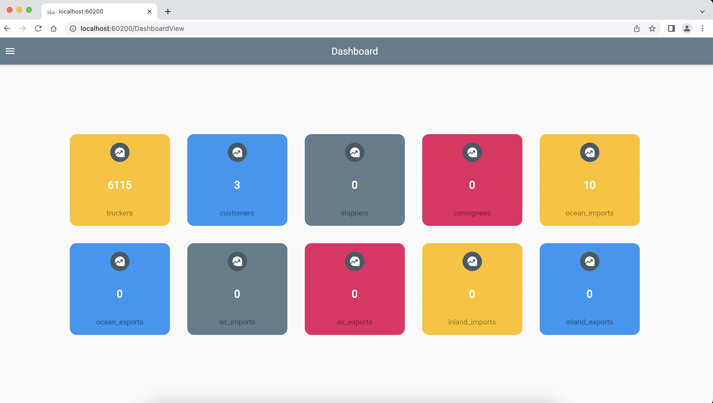
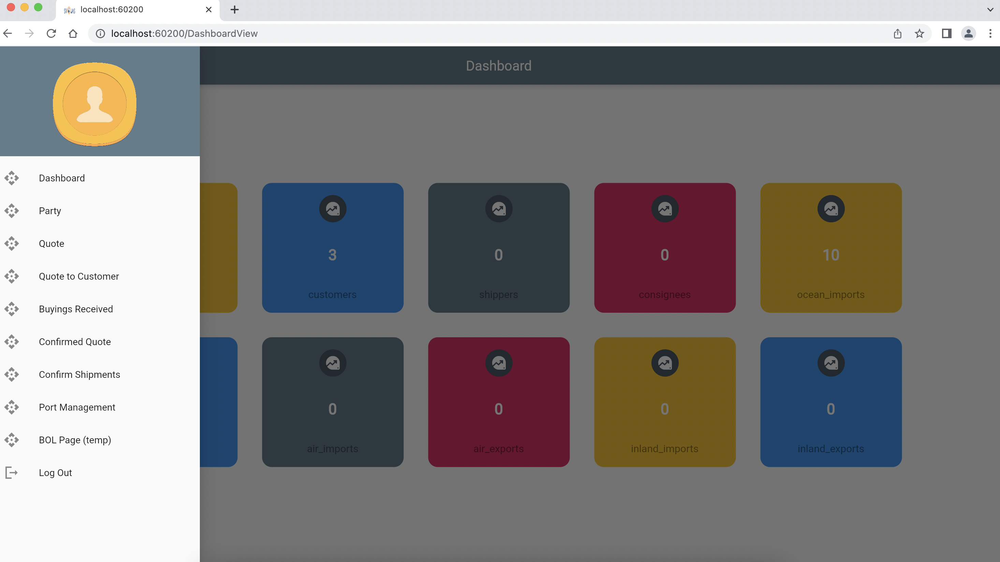
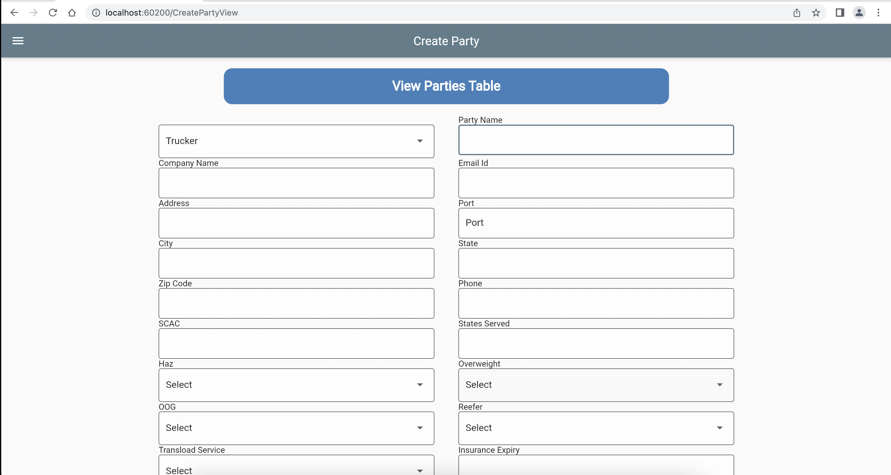
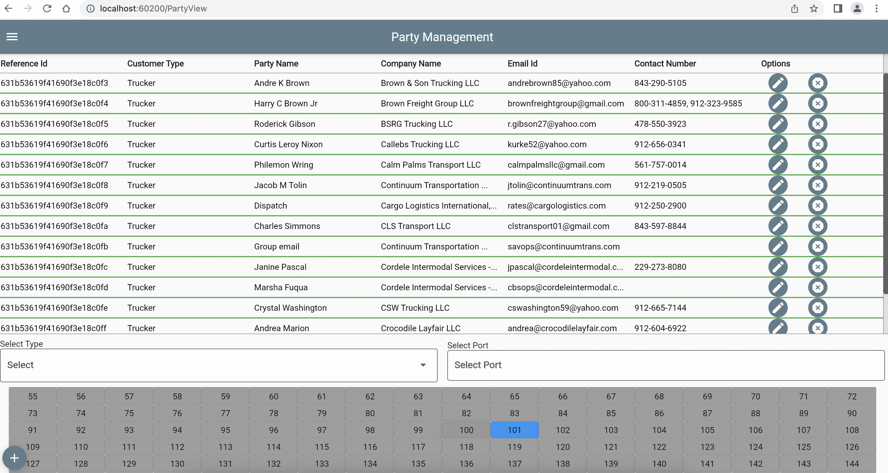
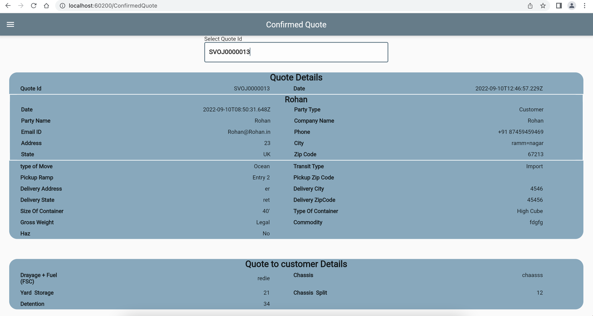

# svojasweb

A Flutter Based website for Shipments Management

## Getting Started

This Application is used to manage Shipments :

Customers,Truckers Info can be created.

Quotes can be created and deleted.

  
  

A few resources to get you started if this is your first Flutter project:

- [Lab: Write your first Flutter app](https://flutter.dev/docs/get-started/codelab)
- [Cookbook: Useful Flutter samples](https://flutter.dev/docs/cookbook)

For help getting started with Flutter, view our
[online documentation](https://flutter.dev/docs), which offers tutorials,
samples, guidance on mobile development, and a full API reference.
